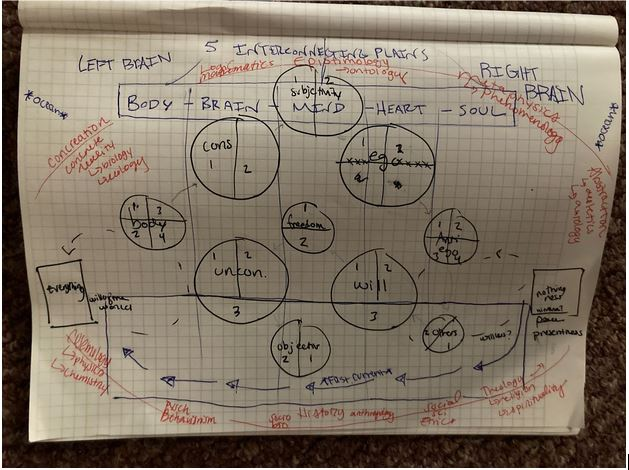
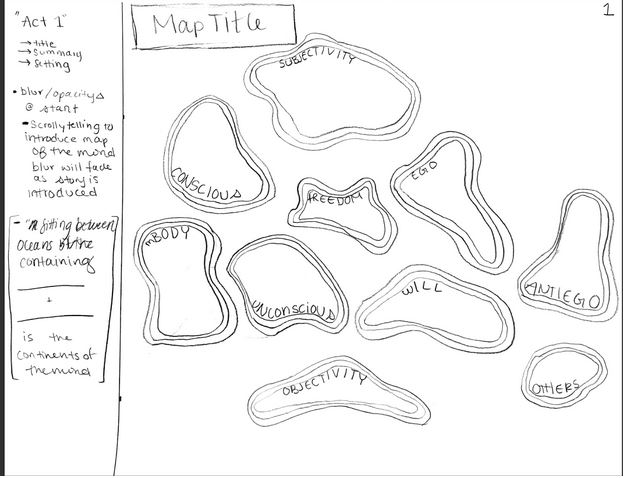
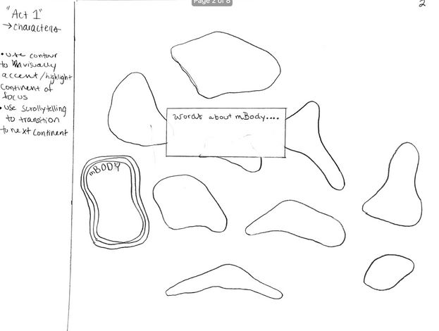

# Project Title
Psychological Geography - Mapping the Continents of the Mind
### Team Members
Luke, Randi, Annika
### Final Proposal
1. Persona/Scenario
    1. Persona
The users of the Continents of the Mind are Logan Edwards, Professor of mental wellness at UW-Whitewater and his students who likely have some background in psychology or physiology. This map will be used to communicate ideas that Prof. Edwards has synthesized from psychology and philosophy literature. Prof. Edwards has created a word cloud infographic but lacks a clear design for relating concepts, general organization, as well as using a geographic metaphor to make these concepts more accessible to a broader audience. Prof. Edwards finds it difficult to communicate comparisons between continents and find patterns and between the components of each continent. Additionally, it is important that Prof. Edwards’ students make associations between continents as parts of one’s body, brain, mind, heart, and soul, as well as different sections of the brain (i.e. left and right brain). By making these associations, the user will gain a more comprehensive insight on how psychological and physiological phenomena play a significant role in the formation of personal spirituality, religion, morals, etc., as well as the history of psychological and philosophical thought that has contributed to these concepts. Ultimately, his goal is to create an interactive map to be used as a therapeutic tool for exploring connections in the mind and finding common ground between the ways people have thought about the mind and consciousness. Our interactive will be the first step toward that longer term goal.

    2. Scenario
Bart: Prospective psychology/philosophy major  
Upon arriving at the Continents of the Mind, the user, Bart, a psychology student, is welcomed to the world of psychological geography. Bart is prompted to scroll, revealing/identifying continents, their names, organic shapes and sizes. After each continent is identified, Bart is prompted to scroll to identify the regions that make up the continents as the map now has gained an added layer of complexity. As complexity increases, Bart can compare similar or different attributes of one continent to those of the next. With continued (controlled) exploration of the map (though scroll) Bart reveals additional information, specifically “governing bodies” of the continents, allowing the user to make connections (associate) between the continents and governing bodies. Bart  is then taken through a hypothetical “thought loop” displaying common thought patterns, and identifying an outlier that allows the loops to be left.  Finally, Bart is able to explore the map. 

Use case 2: Prof. Edwards is giving a TED talk style presentation. This scrolling website is used as a backdrop to accompany his talk and help facilitate the communication of his work.

2. Requirements Document
Map Features
| # | Short Name | Data Creation | Representation |
| ------------- | ------------- | ------------- | ------------- |
| 1  | Basemap  | n/a | A leaflet basemap with a hand drawn aesthetic for the backdrop of the continents  |
| 2  | Continents | Hand-drawn continent outlines, digitized (10) Assigned coordinates to an arbitrary location.  | “Organic” shapes, minimal  |
| 3  | Regions  | Hand-drawn region on each continent  | “Organic” lines, topologically within continents. Blurred lines represent ambivalent boundaries  |
| 4  | Governing Bodies  | Rectangle polygon layer (5)  | 5 blurred areas underneath the other map features. A color spectrum: body→brain→mind→heart→soul  |
| 5  | Everything/Nothing  | Rectangle polygon layer (2)  | These two polygons will be visually part of the color spectrum from “governing bodies” Everything on the far left (white) nothing on the far right (black)  |
| 6  | Discipline  | Point layer (10) surrounding the map  | Text labels only  |

Interaction
| # | Short Name | Description |
| ------------- | ------------- | ------------- |
| 1  | "Map Tour"  | As the user scrolls, the view will pan and zoom as new areas on the map are revealed. Leaflet extension zoomify will allow us to accomplish this effect with a rasterized hand drawn map  |
| 2  | Hover | When the user reaches the full map at the end of the scrolling, they will have the ability to hover over the map elements. On hover, the element will highlight and a short (few words) description will appear.  |
| 3  | Click  | Clickable map features (continents, regions, everything/nothing) will show a popup when clicked. Popup will have more details (1-2 paragraphs), prominent thinkers/works, with links to learn more about them.  |
| 4  | Overlay (possibly)  | Ability to toggle on/off contextextual, non-map features by clicking buttons on the interface.  |
| 5  | Annotate  | To facilitate a clean hand off to Prof. Edwards at the end of the project, we want to include a function where he can add notes to parts of the map that are saved as a text document.  |

3. Wireframes

